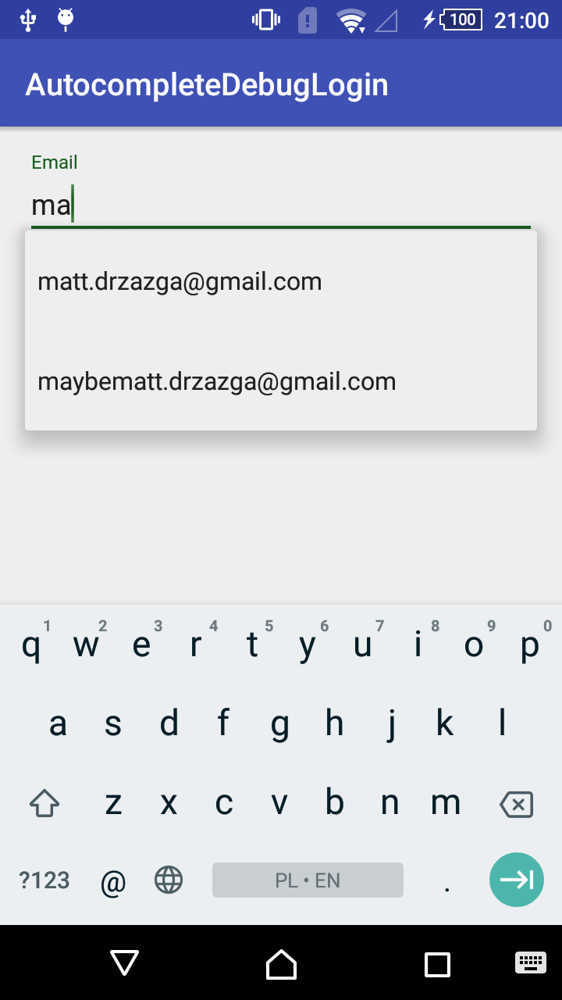
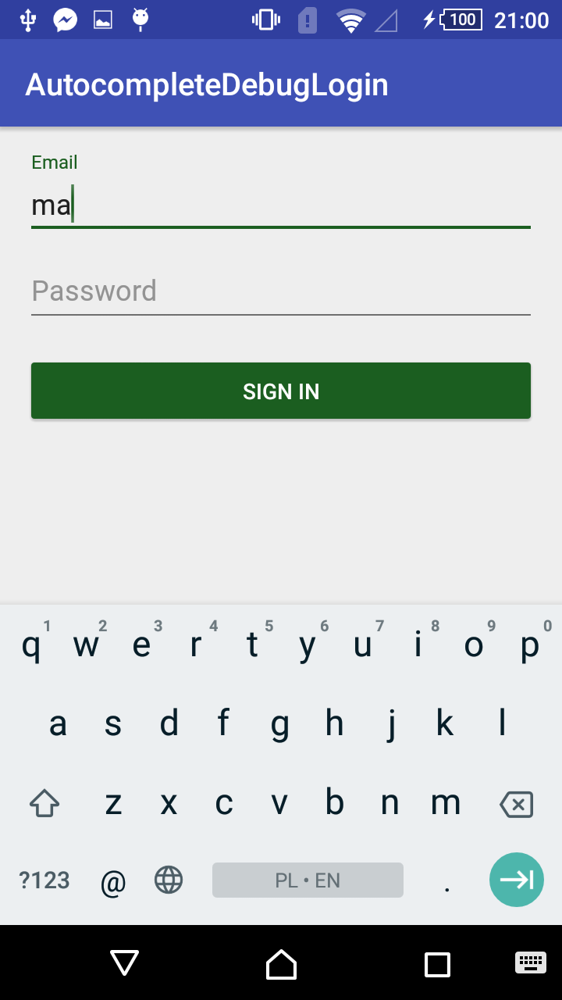

# AutocompleteDebugLogin
Login screen with autocomplete enabled in Debug build config.

When you are developing a new app, you probably have to sign in all the time using different credentials to test different scenarios.
What's very tempting is to hardcode credentials into input fields (just for testing;) )
You do such and then you forget...

This example shows how to achieve autocompletion in debug variant.
When you want to deploy app just switch to release and all of the autocomplete staff will not be built into the apk.

To provide own credentials edit ````accounts.xml(debug)```` and paste you data in the following format.
````
<?xml version="1.0" encoding="utf-8"?>
<resources>
    <array name="accounts">
        <item>matt.drzazga@gmail.com:totally_not_password</item>
        <item>notmatt.drzazga@gmail.com:totally_not_password</item>
        <item>maybematt.drzazga@gmail.com:totally_not_password</item>
        <item>ratherNotmatt.drzazga@gmail.com:totally_not_password</item>
    </array>
</resources>
````

Debug variant
====


Release variant
====

